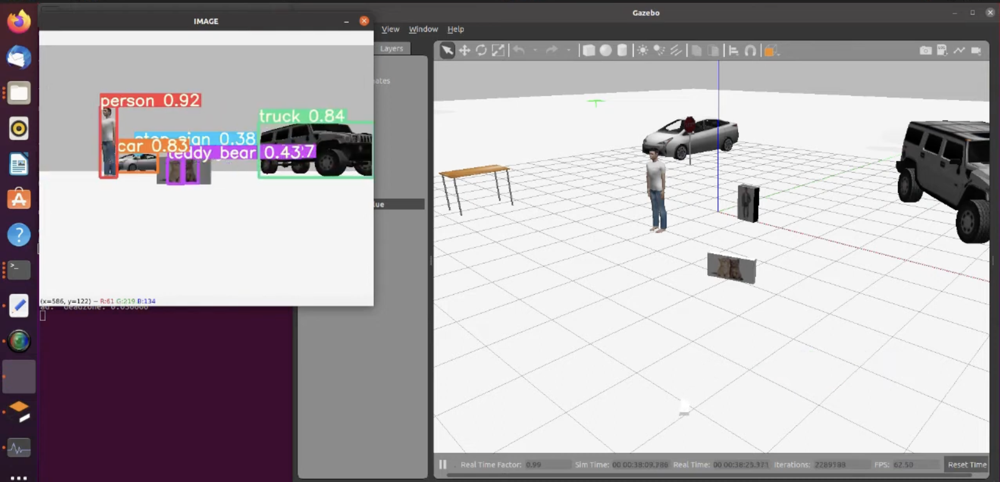

Github Repository - https://github.com/Vaibhav150123045/object_detection_gazebo_ros2/tree/main

***

# Object Detection in Gazebo with ROS2

This repository provides an end-to-end pipeline for performing real-time YOLOv8 object detection within a simulated Gazebo environment using ROS2. 

The system captures the video feed from a simulated robot's onboard camera, processes each frame through a CPU-optimized YOLOv8 inference engine, and outputs the results. It publishes both a structured list of detections (bounding boxes, classes, and confidence scores) and an annotated image stream that can be viewed live.

---

## 📸 Demonstration


*An example frame from the simulated camera feed. The pipeline detects entities in the environment, overlaying bounding boxes, class labels, and confidence metrics directly onto the `/yolo/annotated_image` topic.*

---

## 🏗️ System Architecture

```text
                       Gazebo Simulation Environment
                       ┌──────────────────────────┐
                       │  Simulated Robot Model   │
                       │  └─ Camera Sensor ───────┼──► Gazebo Image Topic
                       └──────────────────────────┘     
                                                              │
                                                              ▼
                                              ┌─────────────────────────────┐
                                              │  ros_gz_image_bridge        │
                                              │  (Bridges Gz to ROS2 Image) │
                                              └─────────────────────────────┘
                                                              │
                                                              ▼ sensor_msgs/Image
                                              ┌─────────────────────────────┐
                                              │  YOLO Recognition Script    │
                                              │  (ros_recognition_yolo.py)  │
                                              │  ───────────────────────    │
                                              │  • cv_bridge to OpenCV      │
                                              │  • YOLOv8 on CPU            │
                                              │  • Extracts bounding boxes  │
                                              └─────────────────────────────┘
                                                   │                    │
                              Custom Detection     │                    │  sensor_msgs/Image
                              Array Messages       ▼                    ▼
                                       /yolo/detections      /yolo/annotated_image
                                                                          │
                                                                          ▼
                                                                  rqt_image_view
```

---

## ✨ Key Features

* **Real-Time CPU Inference:** Runs YOLOv8 object detection entirely on the CPU, making it accessible for machines without dedicated NVIDIA GPUs.
* **Live Visualization:** Generates an annotated video feed to visually verify bounding boxes and classification accuracy in real-time.
* **Structured Data Output:** Publishes detailed detection metadata (class IDs, coordinates, and confidence levels) via custom ROS2 messages for downstream processing.
* **Modular Package Structure:** Cleanly separates the core recognition scripts and custom message definitions within the `packages/` directory.

---

## 🛠️ Prerequisites

Since this setup is configured for CPU inference, you do not need the NVIDIA Container Toolkit or a dedicated GPU. Ensure your system has the following installed:

* **ROS2** (Humble, Iron, or Jazzy)
* **Gazebo** (Harmonic or Fortress, depending on your ROS2 distribution)
* **Python 3.x**
* Python dependencies: `torch`, `torchvision`, `ultralytics`, `opencv-python`, `numpy<2` (Important: `numpy` must be 1.x to avoid `cv_bridge` conflicts in ROS2).

---

## 🚀 Setup & Installation

Clone the repository and build the workspace. 

```bash
# 1. Create a workspace and clone the repository
mkdir -p ~/ros2_ws/src
cd ~/ros2_ws/src
git clone https://github.com/Vaibhav150123045/object_detection_gazebo_ros2.git

# 2. Install Python dependencies
pip3 install torch torchvision ultralytics opencv-python "numpy<2"

# 3. Build the ROS2 workspace
cd ~/ros2_ws
colcon build --symlink-install

# 4. Source the environment
source install/setup.bash
```

---

## 🏃‍♂️ Running the Pipeline

You will need multiple terminal windows to run the simulation, the bridge, the detector, and the visualizer. **Remember to source your ROS2 workspace (`source install/setup.bash`) in every new terminal.**

### Terminal 1: Launch Gazebo Simulation
Start your Gazebo world and spawn your robot model containing the camera sensor. *(Replace the launch command below with your specific simulation launch file).*
```bash
ros2 launch <your_robot_package> <your_simulation_launch_file>.launch.py
```

### Terminal 2: Image Bridge
Bridge the image topic from Gazebo into the ROS2 ecosystem. 
```bash
ros2 run ros_gz_image image_bridge /camera/image_raw
```

### Terminal 3: YOLO Detector Node
Execute the main recognition script. On the first run, the script will automatically download the lightweight YOLOv8 weights.
```bash
python3 src/object_detection_gazebo_ros2/packages/yolobot_recognition/scripts/ros_recognition_yolo.py
```
*Note: Because this runs on the CPU, expect lower frames-per-second (FPS) compared to a GPU environment. The lightweight `yolov8n.pt` model is recommended for best performance.*

### Terminal 4: Visualization
Open `rqt_image_view` to see the live, annotated feed from the YOLO detector.
```bash
ros2 run rqt_image_view rqt_image_view /yolo/annotated_image
```

To view the raw detection data in the terminal:
```bash
ros2 topic echo /yolo/detections
```

---

## 📂 Repository Structure

```text
object_detection_gazebo_ros2/
├── README.md
└── packages/
    ├── yolobot_recognition/         # Core detection package
    │   ├── package.xml
    │   ├── CMakeLists.txt
    │   └── scripts/
    │       └── ros_recognition_yolo.py  # Main YOLO inference node
    └── custom_msgs/                 # Custom ROS2 messages (if applicable)
        ├── package.xml
        ├── CMakeLists.txt
        └── msg/
            ├── Detection.msg
            └── DetectionArray.msg
```

---

## 📝 Implementation Details & Troubleshooting

* **CPU Performance:** Running YOLO on a CPU will inherently increase latency. If the simulation seems out of sync with the detections, consider lowering the resolution of the simulated camera in Gazebo or adjusting the simulation step size.
* **Numpy Version Compatibility:** ROS2's `cv_bridge` is currently built against the Numpy 1.x ABI. Using Numpy 2.x will likely result in a segmentation fault when the script attempts to convert ROS Image messages to OpenCV formats. Ensure you strictly pin `numpy<2`.
* **Script Execution:** If you encounter permission errors running the Python script, ensure it is executable: `chmod +x packages/yolobot_recognition/scripts/ros_recognition_yolo.py`.
